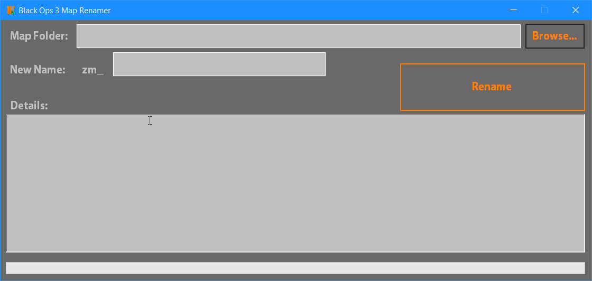

# BlackOps3MapRenamer
Easily rename your custom zombies map file with few clicks.
- Makes a backup
- Renames inside files
- Renames led (built light) files
- Renames map source files
- Renames all files inside the map folder that's found in usermap

## Installation
- dotnet framework 4.8 runtime (https://dotnet.microsoft.com/en-us/download/dotnet-framework/net48)
- The tool .exe

## Notes
- If you run the tool using administrator, the browse button would automatically locate to steam folder

